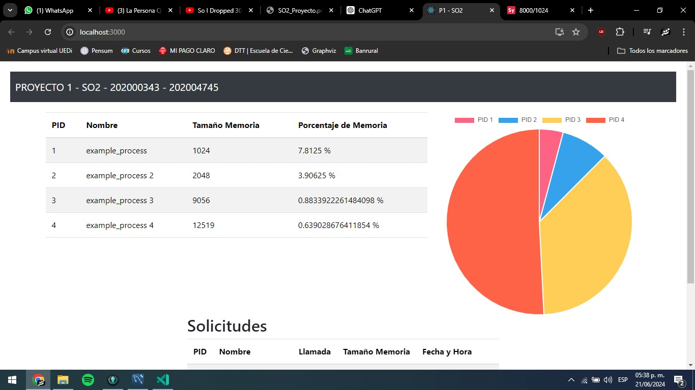
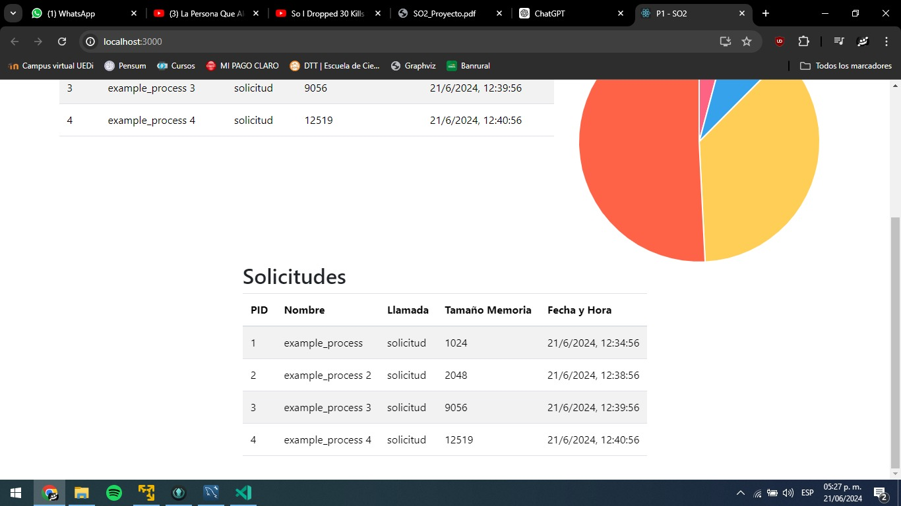

# PROYECTO - Sistemas Operativos 2 - Grupo 9

**Luis Manuel Chay Marrroquin - 202000343**

**Allen Giankarlo Roman Vasquz - 202004745**

## Lector
Se ha creado un script de SystemTap que se encarga de capturar las solicitudes de memoria de todos los procesos activos, estas solicitudes son realizadas por medio de estas llamadas al sistema: `mmap2` y `munmap`. Con el lenguaje de C se capturan estos eventos y se almacenan en una base de datos MySQL.

**Script de SystemTap:**

```systemtap
probe syscall.mmap2 {
    printf("mmap: PID=%d NAME=%s ADDR=0x%lx LENGTH=%ld TIME=%s\n", pid(), execname(), start, length, ctime(gettimeofday_s()))
}

probe syscall.munmap {
    printf("munmap: PID=%d NAME=%s ADDR=0x%lx LENGTH=%ld TIME=%s\n", pid(), execname(), start, length, ctime(gettimeofday_s()))
}
```

**Codigo en C:**

```c
int main() {
    FILE *fp;
    char buffer[BUFFER_SIZE];

    fp = popen("stap -c 'sleep 10' memory_monitor.stp", "r");
    if (fp == NULL) {
        perror("Failed to run SystemTap script");
        exit(1);
    }

    printf("SystemTap script started...\n");

    while (fgets(buffer, sizeof(buffer), fp) != NULL) {
        char pid[16], name[64], call[8], addr[32], length[16], timestamp[32];

        // Intentar parsear para 'mmap'
        if (sscanf(buffer, "mmap: PID=%15s NAME=%63s ADDR=%31s LENGTH=%15s TIME=%31[^\n]", pid, name, addr, length, timestamp) == 5) {
            fprintf(stdout, "PID: %s\n", pid);
            insert_into_db(pid, name, "mmap", addr, length, timestamp);
        }
        // Intentar parsear para 'munmap'
        else if (sscanf(buffer, "munmap: PID=%15s NAME=%63s ADDR=%31s LENGTH=%15s TIME=%31[^\n]", pid, name, addr, length, timestamp) == 5) {
            fprintf(stdout, "PID: %s\n", pid);
            insert_into_db(pid, name, "munmap", addr, length, timestamp);
        } else {
            fprintf(stderr, "Failed to parse: %s\n", buffer);
        }
    }

    printf("SystemTap script finished.\n");

    pclose(fp);
    return 0;
}
```


## Base de Datos
Se ha creado una base de datos en MySQL que almacena la información de las solicitudes de memoria de los procesos activos.

**Insercion desde C:**

```c
void insert_into_db(const char *pid, const char *name, const char *call, const char *addr, const char *length, const char *timestamp) {
    MYSQL *conn;
    MYSQL_RES *res;
    MYSQL_ROW row;

    char query[BUFFER_SIZE];
    char formatted_timestamp[64];

    struct tm timeinfo;
    memset(&timeinfo, 0, sizeof(struct tm));

    // Utilizar sscanf para extraer los componentes de la fecha y hora
    int day, year, hour, min, sec;
    char month[4];

    if (sscanf(timestamp, "%*s %3s %d %d:%d:%d %d", month, &day, &hour, &min, &sec, &year) != 6) {
        fprintf(stderr, "Failed to parse timestamp: %s\n", timestamp);
        return;
    }

    // Convertir el mes de cadena a número
    const char *months[] = {"Jan", "Feb", "Mar", "Apr", "May", "Jun", "Jul", "Aug", "Sep", "Oct", "Nov", "Dec"};
    int month_num = 0;
    while (strcmp(month, months[month_num]) != 0 && month_num < 12) {
        month_num++;
    }
    if (month_num == 12) {
        fprintf(stderr, "Invalid month: %s\n", month);
        return;
    }

    timeinfo.tm_mon = month_num;
    timeinfo.tm_mday = day;
    timeinfo.tm_hour = hour;
    timeinfo.tm_min = min;
    timeinfo.tm_sec = sec;
    timeinfo.tm_year = year - 1900;

    // Formatear la fecha y hora en el formato YYYY-MM-DD HH:MM:SS
    strftime(formatted_timestamp, sizeof(formatted_timestamp), "%Y-%m-%d %H:%M:%S", &timeinfo);

    conn = mysql_init(NULL);
    if (conn == NULL) {
        fprintf(stderr, "mysql_init() failed\n");
        return;
    }

    if (mysql_real_connect(conn, "34.31.162.29", "root", "adminso2", "dbso2", 0, NULL, 0) == NULL) {
        fprintf(stderr, "mysql_real_connect() failed\n");
        mysql_close(conn);
        return;
    }

    printf("Connected to MySQL server.\n");

    snprintf(query, sizeof(query), "INSERT INTO procesos (pid, nombre, llamada, tamanio_memoria, fechahora) VALUES ('%s', '%s', '%s', '%s', '%s')", pid, name, call, length, formatted_timestamp);

    if (mysql_query(conn, query)) {
        fprintf(stderr, "INSERT error: %s\n", mysql_error(conn));
    } else {
        printf("Insert successful.\n");
    }

    mysql_close(conn);
}
```

**Script de creacion de la base de datos:**

```sql
-- Crear la base de datos dbso2
CREATE DATABASE dbso2;

-- Usar la base de datos dbso2
USE dbso2;

-- Crear la tabla llamada 'process_logs' con los atributos especificados
CREATE TABLE procesos (
    pid INT NOT NULL,
    nombre VARCHAR(255) NOT NULL,
    llamada VARCHAR(255) NOT NULL,
    tamanio_memoria INT NOT NULL,
    fechahora DATETIME NOT NULL
    );
```

## API
Se ha creado una API en Node.js que se encarga de exponer los datos almacenados en la base de datos MySQL. La API cuenta una ruta para obtener todos los registros de la tabla `procesos` 

**Codigo de la API:**

```javascript
require('dotenv').config(); // Cargar las variables de entorno desde el archivo .env
const express = require('express');
const mysql = require('mysql2');
const cors = require('cors');

// Crear una aplicación Express
const app = express();
const port = process.env.PORT || 5000;

// Middleware para parsear JSON
app.use(express.json());

// Middleware para habilitar CORS
app.use(cors());

// Configurar la conexión a la base de datos usando variables de entorno
const db = mysql.createConnection({
    host: process.env.DB_HOST,
    user: process.env.DB_USER,
    password: process.env.DB_PASSWORD,
    database: process.env.DB_NAME
});

// Conectar a la base de datos
db.connect((err) => {
    if (err) {
        console.error('Error conectando a la base de datos:', err.stack);
        return;
    }
    console.log('Conectado a la base de datos MySQL');
});

// Obtener todos los logs de proceso
app.get('/process_logs', (req, res) => {
    const query = 'SELECT * FROM procesos';
    db.query(query, (err, results) => {
        if (err) {
            res.status(500).json({ error: err.message });
        } else {
            res.status(200).json(results);
        }
    });
});

// Iniciar el servidor
app.listen(port, () => {
    console.log(`API escuchando en http://localhost:${port}`);
});
```

## Frontend React

En el frontend se podra visualizar la informacion del uso de memoria, donde se mostrara una grafica de pie donde se muestre el porcentaje de toda la memoria solictada segun fue realzada para un maximo de 10 procesos, a su vez se incuye una tabla donde se listen todas las solicitudes de memoria realizadas por los procesos.

**Grafica de pie:**



**Tabla de solicitudes:**

